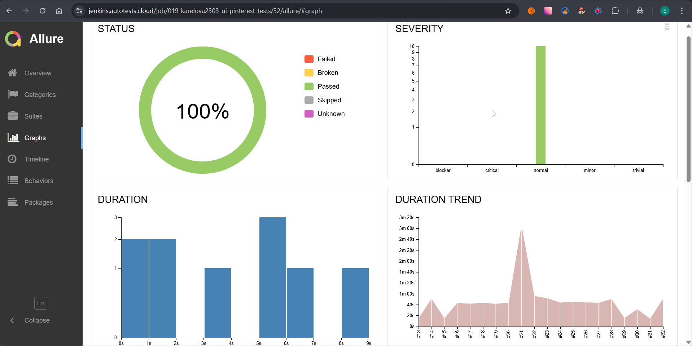

<h1> Проект по тестированию web-приложения <a target="_blank" href="https://ru.pinterest.com/">"Pinterest"</a>
</h1>


<h3> Список UI проверок:</h3>

### Проверки, реализованные в автоматизированных тестах
- [x] Проверка авторизации пользователя
  - Успешная авторизация пользователя через email
  - Разлогинивание пользователя
- [x] Проверка профиля пользователя
  - Проверка кликабельнсти иконок общего доступа
  - Проверка перехода на вкладку "Доски"
  - Проверка перехода на вкладку "Пины"
  - Открытие страницы публичного профиля
  - Редактирование профиля
- [x] Проверка строки поиска
  - Поиск контента по введенному значению
  - Поиск контента при выборе из меню "Идеи для вас"
  - Поиск с установленным фильтром

### Проверки, реализованные в ручных тестах
- [x] Проверка авторизации пользователя через Facebook
- [x] Проверка авторизации пользователя через Google
- [x] Проверка неуспешной авторизации с пустыми полями логин / пароль
- [x] Изменение персональных данных

----
### Проект реализован с использованием:
<div align="center">
  &nbsp;
  &nbsp; 
  &nbsp;  
  &nbsp;
  &nbsp; 
  &nbsp;    
  &nbsp;
  &nbsp;
  &nbsp;
  &nbsp;
&nbsp;
</div>

----
### Локальный запуск

1. Склонировать репозиторий
2. Установить зависимости командой `pip install -r requirements.txt`
3. Открыть проект в PyCharm, установить интерпретатор
4. Создать `.env` файл, пример файла - `.env.example`, находится в корне проекта
5. Запустить тесты в командной строке:
```bash
pytest --browser_version={BROWSER_VERSION} 
```

> [!IMPORTANT]
> 
> Параметр `--browser_version` - версия браузера Chrome (128.0, 127.0), по умолчанию 128.0

----
### Удаленный запуск автотестов выполняется на сервере Jenkins
> <a target="_blank" href="https://jenkins.autotests.cloud/job/019-karelova2303-ui_pinterest_tests/">_**Ссылка на сборку в Jenkins**_</a>


#### Для запуска автотестов в Jenkins

1. Открыть <a target="_blank" href="https://jenkins.autotests.cloud/job/019-karelova2303-ui_pinterest_tests/">проект</a>
2. Выбрать пункт `Build with Parameters`
3. Выбрать параметры - `BROWSER_VERSION`
3. Нажать кнопку `Build`


----
### Allure отчет

#### Формирование отчета:
>-  локальный запуск: ввести в командной строке `allure serve allure-results`
>-  запуск через Jenkins: кликнуть кнопку `Allure Report` в боковом меню 

#### Результаты запусков




----
### Интеграция с Allure TestOps

> <a target="_blank" href="https://allure.autotests.cloud/project/4777/dashboards">_**Ссылка на проект в Allure TestOps**_</a>

#### Пример dashboard с общими результатами тестирования


#### Общий список всех тест-кейсов


#### Автоматизированные и ручные тесты хранятся в одной директории 


#### Пример отчёта выполнения одного из автотестов


#### Пример dashboard с результатами запуска


#### История запуска тестовых наборов


----
### Интеграция с Jira
> <a target="_blank" href="https://jira.autotests.cloud/browse/HOMEWORK-1463">_**Ссылка на задачу в Jira**_</a>


----
### Оповещение о результатах прогона тестов в Telegram


----

### Пример видео прохождения ui-автотеста
<p align="center">
    
</p>